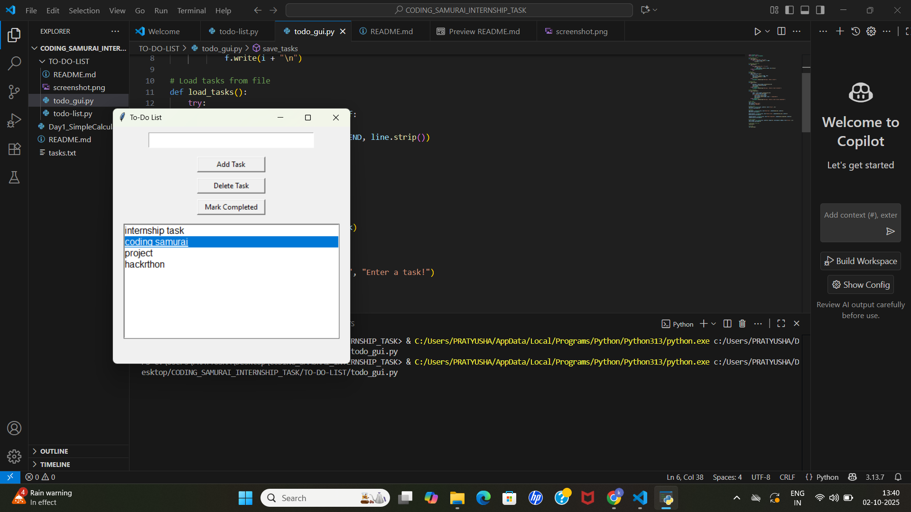

# 📌 To-Do List Project 📝

A simple **To-Do List application** built in Python with both **CLI (Command Line)** and **GUI (Tkinter)** versions.  
This project helps manage daily tasks with options to add, delete, view, and mark tasks as completed.  
Tasks are stored in a `tasks.txt` file so they remain saved even after closing the program.

---

## 🚀 Features

- ✅ Add new tasks  
- ✅ View all tasks  
- ✅ Mark tasks as Completed  
- ✅ Delete tasks  
- ✅ Persistent storage (`tasks.txt`)  
- ✅ Two versions:
  - `todo_list.py` → CLI version (runs in terminal)  
  - `todo_gui.py` → GUI version (Tkinter-based)  

---

## 🖥️ Screenshots

**GUI Version:**  

  
*Replace `screenshot_gui.png` with your actual GUI screenshot file.*

**CLI Version Example:**
```text
====== TO-DO LIST ======

View Tasks

Add Task

Mark Task as Completed

Delete Task

Exit
👉 Enter your choice: 2
➕ Enter new task: Finish coding assignment
✅ Task added!
```
## ⚡ How to Run

### ▶ Run CLI Version
```bash
python todo_list.py
```
### ▶ Run GUI Version
```bash
python todo_gui.py
```
## 📂 Project Structure
```text
ToDoList/
│── todo_list.py       # CLI version
│── todo_gui.py        # GUI (Tkinter) version
│── tasks.txt          # Stores tasks (auto-created)
│── README.md          # Documentation
│── screenshot_gui.png # GUI screenshot
```
## 🛠 Requirements

- Python 3.x
- Tkinter (comes pre-installed with Python)

📌 Author

👩‍💻 Developed by Kona Pratyusha
📍 Coding Samurai Internship Task